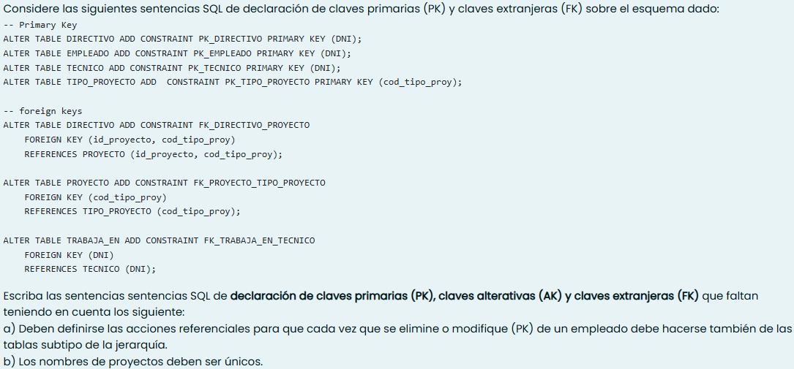
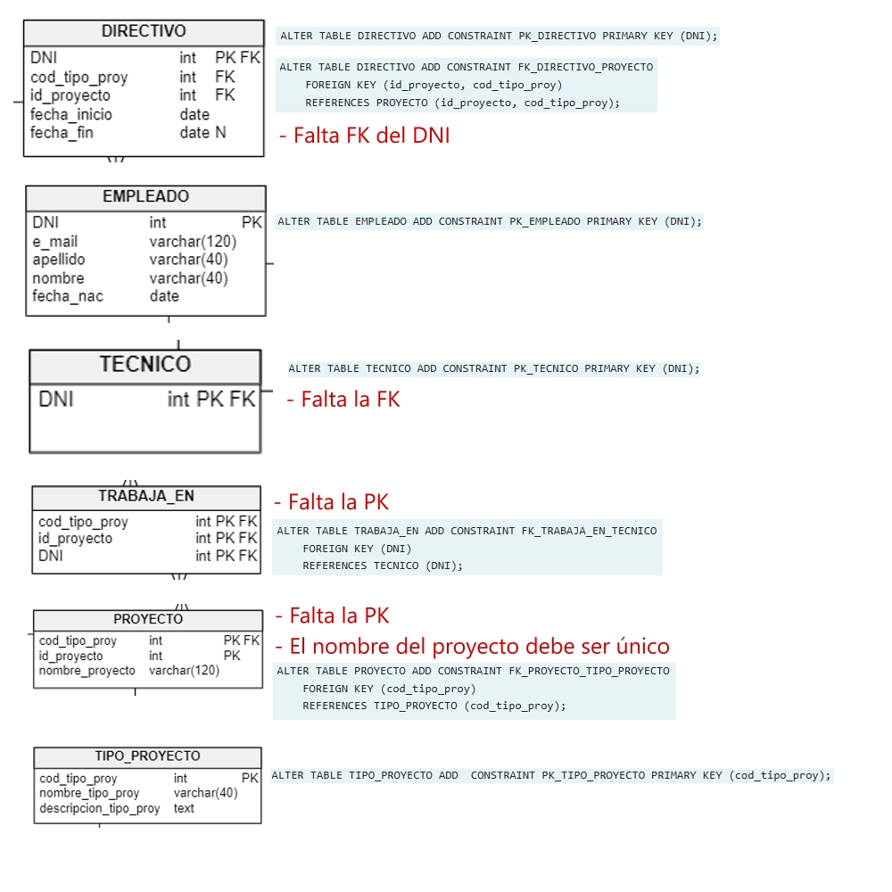

<h1>Consigna 1</h1>


```SQL
CREATE ASSERTION control_modalidades
    CHECK(
        NOT EXIST(
            SELECT 1
            FROM provee
            WHERE (CUIT, cod_tipo_sum, id_suministro) IN(
                SELECT CUIT, cod_tipo_sum, id_suministro
                FROM uni_suministro
            )
        )
    )
```

La restricción anterior verifica que los datos (columnas que conforman la pk) que se encuentran en la tabla provee (relación entre suministro y multi_suministro) no se encuentren también en la tabla uni_suministro, garantizando que un mismo suministro no sea ofrecido en sus dos modalidades por una misma empresa.

```SQL
CREATE OR REPLACE FUNCTION fn_control_modalidades_provee() RETURNS TRIGGER AS $$
    BEGIN
        IF EXISTS(
            SELECT 1
            FROM uni_suministro un
            WHERE NEW.cod_tipo_sum = un.cod_tipo_sum
            AND NEW.id_suministro = un.id_suministro
            AND NEW.CUIT = un.id_CUIT
        ) THEN
            RAISE EXCEPTION 'El suministro ya es ofrecido en su modalidad uni_suministro por la empresa con CUIT %', NEW.CUIT;
    END $$
    LANGUAGE plpgsql;

CREATE OR REPLACE TRIGGER tr_control_modalidades_provee
    BEFORE INSERT OR UPDATE OF cod_tipo_sum, id_suministro, CUIT ON provee
    FOR EACH ROW
    EXECUTE FUNCTION fn_control_modalidades_provee();

CREATE OR REPLACE FUNCTION fn_control_modalidades_uni_suministro() RETURNS TRIGGER AS $$
    BEGIN
        IF EXISTS(
            SELECT 1
            FROM provee p
            WHERE NEW.cod_tipo_sum = p.cod_tipo_sum
            AND NEW.id_suministro = P.id_suministro
            AND NEW.CUIT = p.id_CUIT
        ) THEN
            RAISE EXCEPTION 'El suministro ya es ofrecido en su modalidad multi_suministro por la empresa con CUIT %', NEW.CUIT;
    END $$
    LANGUAGE plpgsql;

CREATE OR REPLACE TRIGGER tr_control_modalidades_uni_suministro
    BEFORE INSERT OR UPDATE OF CUIT, cod_tipo_sum, id_suministro ON uni_suministro
    FOR EACH ROW
    EXECUTE FUNCTION fn_control_modalidades_uni_suministro();
```

<h1>Consigna 2</h1>




<h3>Ayuda visual</h3>
Imagen con cada tabla y las definiciones dadas por la cátedra para ver más claramente las claves faltantes.



```SQL
-- Declaración de claves faltantes para tabla "directivo".
ALTER TABLE directivo   --tabla sobre la que actua la RI
ADD CONSTRAINT FK_directivo_empleado    -- Tablas involucradas (por relación PK-FK)
FOREIGN KEY (DNI)
REFERENCES empleado (DNI)
ON UPDATE CASCADE
ON DELETE CASCADE;

-- Declaración de claves faltantes para tabla "técnico".
ALTER TABLE tecnico
ADD CONSTRAINT FK_tecnico_empleado
FOREIGN KEY (DNI)
REFERENCES empleado (DNI)
ON UPDATE CASCADE
ON DELETE CASCADE;

-- Declaración de claves faltantes para tabla "trabaja_en".
ALTER TABLE trabaja_en
ADD CONSTRAINT PK_trabaja_en
PRIMARY KEY (id_proyecto, cod_tipo_proyecto, DNI);

-- Declaración de claves faltantes para tabla "proyecto".
ALTER TABLE proyecto
ADD CONSTRAINT PK_proyecto
PRIMARY KEY (cod_tipo_proy, id_proyecto);

ALTER TABLE proyecto
ADD CONSTRAINT AK_proyecto
UNIQUE (nombre_proyecto);
```

> [!IMPORTANT]
> En las tablas "directivo" y "tecnico" la columna "DNI" hace referencia a la columna (PK) "DNI" de la tabla "empleado". Como la consigna nos pide que ante una modificación o update en la tabla "empleado", los mismos se vean reflejados en la tablas que la referencian, utilizamos CASCADE al definir las contraints FK_directivo_empleado y FK_tecnico_empleado.

<h1>Consigna 3</h1>


¿Cuál/es de las siguientes operaciones proceden y cuál/es fallan?

```SQL
DELETE FROM SE_INSCRIBE WHERE DNI = ‘38159753’; -- Procede
/*Sus columnas no se referencian en otras tablas, con lo que no habría problema en eliminar un registro de la misma.*/

DELETE FROM ALUMNO WHERE DNI = ’41597842’; -- Falla
/*La columna es referenciada en la tabla "se_inscribe", donde la acción referencial para un delete es de tipo RESTRICT.*/

DELETE FROM MATERIA WHERE id_carrera =’C’;  -- Procede
/*Procede ya que la materia cuyo id_carrera = 'C' no esta referenciado en ninguna otra tabla. Y si fuera asi, también 
procedería ya que la acción referencial para un delete es de tipo CASCADE (la fila en la tabla principal será eliminada 
y también serán eliminadas las filas de otras tablas que la referencian).*/

UPDATE MATERIA SET id_materia = ’3’ WHERE id_carrera =’E’;  -- Falla
/*No se puede ya que la materia cuyo id_carrera =’E’ esta refenciada en la tabla "se_incribe", donde la acción referencial
para un update es de tipo RESTRICT.*/

UPDATE SE_INSCRIBE SET id_materia = 2 WHERE DNI = ‘41597842’ AND id_materia = 1;  -- Falla
/*Ya existe en la tabla "se_inscribe" un registro cuyo id_materia = 2 y DNI = ‘41597842’, con lo que rompería con la 
característica de unicidad de la PK*/

UPDATE ALUMNO SET DNI = ‘39852458’ WHERE DNI = ‘39852456’’;  -- Procede
/*El cambio se realiza sobre la tabla "alumno", cuya fila es referenciada en la tabla "se_inscribe". En esta, la acción 
referencial para un update es de tipo CASCADE.*/

DELETE FROM MATERIA WHERE id_materia = 3;  -- Procede
/*La acción definida para un delete en la tabla que referencia "materia" es de tipo CASCADE, con lo que procede y la 
columna de la tabla principal se elimina al igual que aquellas filas en "se_inscribe" que la referencian.*/

```

Puntos a observar

- Comprobar que el cambio que queremos realizar sea no nos genere problemas con las acciones refenciales definidas.
- Que no queden Pk repetidas al realizar un update o un insert.
- Revisar bien que los datos existan en las tablas referenciantes. Puede pasar que por ejemplo un DELETE sea RESTRICT, pero que al no existir el registro en la tabla referenciante, el registro se puede borrar de la referenciada sin problema.

<h1>Consigna 4</h1>

Utilizando el esquema unc_esq_voluntario. Cual/Cuales son los coordinadores(nombre) que han tenido a cargo la mayor cantidad de voluntarios que hayan realizado cualquier tarea terminada en CLERK.

1. Den, Luisa
2. Luisa
3. Ninguna de las opciones es correcta
4. $\color{YellowGreen}{Payam,\ Matthew,\ Adam,\ Kevin,\ Shanta}$
5. Laura, Guy

```SQL
SELECT coor.nro_voluntario, coor.nombre AS "Coordinador", COUNT(v.nombre)
FROM  voluntario v
JOIN voluntario coor ON v.id_coordinador = coor.nro_voluntario
WHERE v.id_tarea ILIKE '%CLERK'
GROUP BY coor.nro_voluntario, coor.nombre
```


<h1>Consigna 5</h1>

Utilizando el esquema unc_esq_voluntarios. Mostrar los nombres  de voluntarios que aportaron 10500  o 11000 hs (sólo esas cantidad).

1. Alberto, Gerald, Eleni, Peter, David

2. David, Sundar, Amit, Lisa

3. No hay registros que cumplan con este requerimiento

4. $\color{YellowGreen}{Gerald,\ Eleni,\ Clara,\ Ellen,\ Den}$

5. Ninguna de las opciones es correcta

```SQL
SELECT v.nombre 
FROM voluntario v
WHERE v.horas_aportadas IN(10500,11000)
```


<h1>Extras</h1>

Scripts de creación de las tablas

```SQL
-- tables
-- Table: EMPRESA
CREATE TABLE EMPRESA (
    CUIT varchar(11)  NOT NULL,
    razon_social varchar(120)  NOT NULL,
    nombre_comercial varchar(120)  NOT NULL,
    e_mail varchar(120)  NOT NULL,
    fecha_inicio_actividades date  NOT NULL,
    CONSTRAINT AK_EMPRESA UNIQUE (e_mail) NOT DEFERRABLE  INITIALLY IMMEDIATE
);

-- Table: MULTI_SUMINISTRO
CREATE TABLE MULTI_SUMINISTRO (
    CUIT varchar(11)  NOT NULL
);

-- Table: PROVEE
CREATE TABLE PROVEE (
    cod_tipo_sum int  NOT NULL,
    id_suministro int  NOT NULL,
    CUIT varchar(11)  NOT NULL
);

-- Table: SUMINISTRO
CREATE TABLE SUMINISTRO (
    cod_tipo_sum int  NOT NULL,
    id_suministro int  NOT NULL,
    nombre_suministro varchar(20)  NOT NULL
);

-- Table: TIPO_SUMINISTRO
CREATE TABLE TIPO_SUMINISTRO (
    cod_tipo_sum int  NOT NULL,
    nombre_tipo_sum varchar(120)  NOT NULL,
    descripcion_tipo_sum text  NOT NULL,
    CONSTRAINT AK_TIPO_SUMINISTRO UNIQUE (nombre_tipo_sum) NOT DEFERRABLE  INITIALLY IMMEDIATE
);

-- Table: UNI_SUMINISTRO
CREATE TABLE UNI_SUMINISTRO (
    CUIT varchar(11)  NOT NULL,
    cod_tipo_sum int  NOT NULL,
    id_suministro int  NOT NULL,
    fecha_inicio date  NOT NULL,
    fecha_fin date  NULL
);
```

```SQL
-- tables
-- Table: DIRECTIVO
CREATE TABLE DIRECTIVO (
    DNI int  NOT NULL,
    cod_tipo_proy int  NOT NULL,
    id_proyecto int  NOT NULL,
    fecha_inicio date  NOT NULL,
    fecha_fin date  NULL
);

-- Table: EMPLEADO
CREATE TABLE EMPLEADO (
    DNI int  NOT NULL,
    e_mail varchar(120)  NOT NULL,
    apellido varchar(40)  NOT NULL,
    nombre varchar(40)  NOT NULL,
    fecha_nac date  NOT NULL,
    CONSTRAINT AK_EMPLEADO UNIQUE (e_mail) NOT DEFERRABLE  INITIALLY IMMEDIATE
);

-- Table: PROYECTO
CREATE TABLE PROYECTO (
    cod_tipo_proy int  NOT NULL,
    id_proyecto int  NOT NULL,
    nombre_proyecto varchar(120)  NOT NULL    
);

-- Table: TECNICO
CREATE TABLE TECNICO (
    DNI int  NOT NULL    
);

-- Table: TIPO_PROYECTO
CREATE TABLE TIPO_PROYECTO (
    cod_tipo_proy int  NOT NULL,
    nombre_tipo_proy varchar(40)  NOT NULL,
    descripcion_tipo_proy text  NOT NULL,
    CONSTRAINT AK_TIPO_PROYECTO UNIQUE (nombre_tipo_proy) NOT DEFERRABLE  INITIALLY IMMEDIATE
);

-- Table: TRABAJA_EN
CREATE TABLE TRABAJA_EN (
    cod_tipo_proy int  NOT NULL,
    id_proyecto int  NOT NULL,
    DNI int  NOT NULL
);
```

<h1>To do</h1>

- [ ] Hacer la imagen que visualice el join en la tabla voluntario
- [ ] Falta el ejercicio de vistas