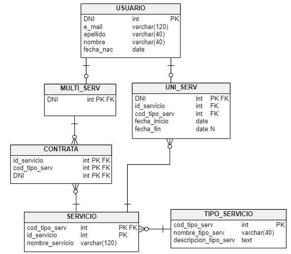
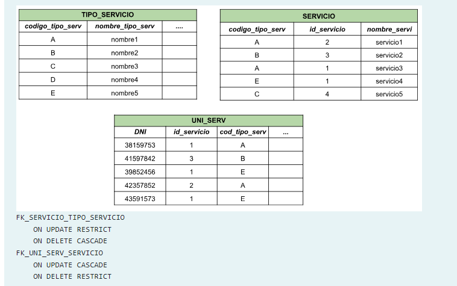
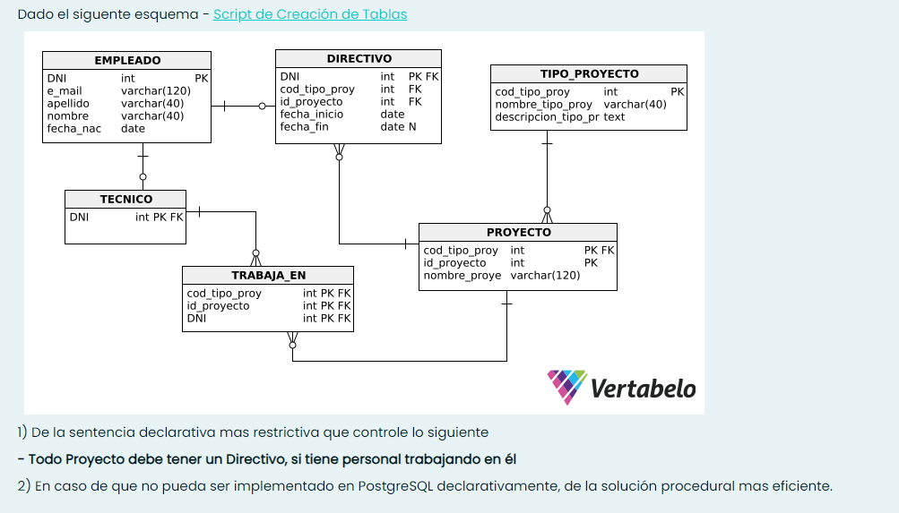
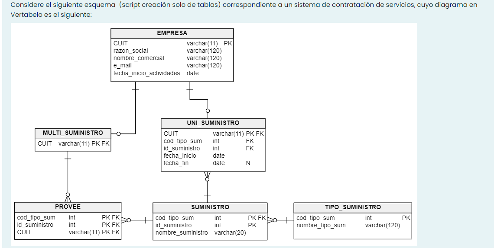
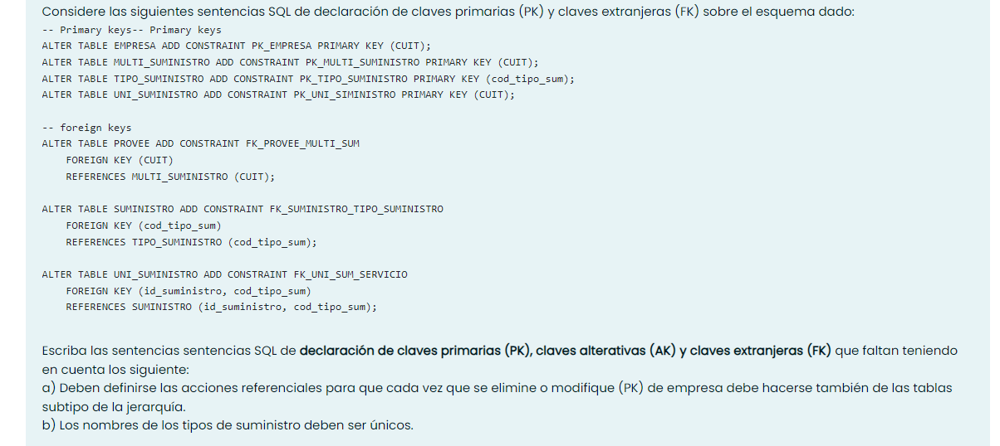

<h1>Consigna 1</h1>

Dado el esquema de la figura



Si las foreign key fueran las que se indican debajo y se encuentran cargados los siguientes datos:



```SQL
DELETE FROM TIPO_SERVICIO WHERE codigo_tipo_serv =’C’;  -- Procede
/*La pk "cod_tipo_serv" de la tabla "tipo_servicio" esta referenciada en la tabla "servicio", cuya acción referencial 
para un delete es de tipo CASCADE. Además, si bien la columna "cod_tipo_serv" esta referenciada en la tabla "uni_serv", 
el registro en particular cuyo codigo_tipo_serv =’C’, no existe en esta tabla.*/

UPDATE TIPO_SERVICIO SET codigo_tipo_serv =’F’ WHERE codigo_tipo_serv =’B’;  -- Falla
/*Si quisieramos cambiar la B por F, no se podria ya que la tabla que la referencia (servicio) tiene definida su acción 
referencial como RESTRICT para los casos de UPDATE.*/

DELETE FROM TIPO_SERVICIO WHERE codigo_tipo_serv =’B’  -- Falla
/*La tabla "servicio" tiene definida su acción referencial como CASCADE para los casos de DELETE. PERO La tabla "uni_serv" 
tiene definida su acción referencial como RESTRICT para los casos de DELETE.*/

UPDATE SERVICIO SET id_servicio = 5 WHERE codigo_tipo_serv =’E’;  -- Procede
/*La tabla referenciante "uni_serv" tiene su acción referencial definida como CASCADE para los UPDATE. Serían dos campos
de dos registros los que se actualizarían en la tabla  "uni_serv" y que quedarian iguales, pero no nos genera problema ya
que no son PK.*/

DELETE FROM SERVICIO WHERE id_servicio = 1;  -- Falla
/*uni_serv referencia la columna id_servicio de la tabla "servicio", y su acción referencial esta definida como RESTRICT
para los casos de DELETE.*/

DELETE FROM UNI_SERV WHERE DNI = ’41597842’;  -- Procede
/*Esa columna no esta referenciada por ninguna de las otras tablas (que tomamos en cuenta para este ejercicio)*/
```

<h1>Consigna 2</h1>
Utilizando el esquema unc_esq_peliculas. Contar todos los distribuidores nacionales cuyo teléfono empiece con 23.

1. Ninguna de las opciones es correcta
2. 0
3. 135
4. $\color{YellowGreen}{7}$
5. 120

```SQL
--Usando solo la tabla distribuidor
SELECT COUNT(id_distribuidor)
FROM distribuidor
WHERE tipo = 'N'
AND telefono ILIKE '23%';

--Usando distribuidor y nacional
SELECT COUNT(id_distribuidor)
FROM distribuidor
WHERE telefono ILIKE '23%'
AND id_distribuidor IN (
    SELECT id_distribuidor FROM nacional
    );
```


<h1>Consigna 3</h1>
Utilizando el esquema unc_esq_voluntario. De qué país(nombre) hay mayor cantidad de voluntarios que realizan una tarea terminada en REP.

1. $\color{YellowGreen}{Reino\ Unido}$

2. Ninguna de las opciones es correcta

3. Canadá

4. Estados Unidos 

5. Alemania

```SQL
-- 1 opción
SELECT p.nombre_pais, COUNT(v.nro_voluntario) AS cant_voluntarios
FROM pais p
JOIN direccion d ON p.id_pais = d.id_pais
JOIN institucion i ON d.id_direccion = i.id_direccion
JOIN voluntario v ON i.id_institucion = v.id_institucion
WHERE id_tarea ILIKE '%REP'
GROUP BY p.nombre_pais
ORDER BY 2 DESC;

-- 2 opción (solo se cambia el ON por USING)
SELECT p.nombre_pais, COUNT(v.nro_voluntario) AS cant_voluntarios
FROM pais p
JOIN direccion d USING (id_pais)
JOIN institucion i USING (id_direccion)
JOIN voluntario v USING (id_institucion)
WHERE id_tarea ILIKE '%REP'
GROUP BY p.nombre_pais
ORDER BY 2 DESC;
```

<h1>Consigna 4</h1>



<h1>Consigna 5</h1>




<h1>Extras</h1>

Scripts de creación de las tablas

```SQL
-- tables
-- Table: DIRECTIVO
CREATE TABLE DIRECTIVO (
    DNI int  NOT NULL,
    cod_tipo_proy int  NOT NULL,
    id_proyecto int  NOT NULL,
    fecha_inicio date  NOT NULL,
    fecha_fin date  NULL
);

-- Table: EMPLEADO
CREATE TABLE EMPLEADO (
    DNI int  NOT NULL,
    e_mail varchar(120)  NOT NULL,
    apellido varchar(40)  NOT NULL,
    nombre varchar(40)  NOT NULL,
    fecha_nac date  NOT NULL,
    CONSTRAINT AK_EMPLEADO UNIQUE (e_mail) NOT DEFERRABLE  INITIALLY IMMEDIATE
);

-- Table: PROYECTO
CREATE TABLE PROYECTO (
    cod_tipo_proy int  NOT NULL,
    id_proyecto int  NOT NULL,
    nombre_proyecto varchar(120)  NOT NULL    
);

-- Table: TECNICO
CREATE TABLE TECNICO (
    DNI int  NOT NULL    
);

-- Table: TIPO_PROYECTO
CREATE TABLE TIPO_PROYECTO (
    cod_tipo_proy int  NOT NULL,
    nombre_tipo_proy varchar(40)  NOT NULL,
    descripcion_tipo_proy text  NOT NULL,
    CONSTRAINT AK_TIPO_PROYECTO UNIQUE (nombre_tipo_proy) NOT DEFERRABLE  INITIALLY IMMEDIATE
);

-- Table: TRABAJA_EN
CREATE TABLE TRABAJA_EN (
    cod_tipo_proy int  NOT NULL,
    id_proyecto int  NOT NULL,
    DNI int  NOT NULL
);
```

<h1>To do</h1>

- [ ] Consigna 4
- [ ] Consigna 5
- [ ] Falta el ejercicio de vistas