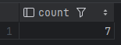
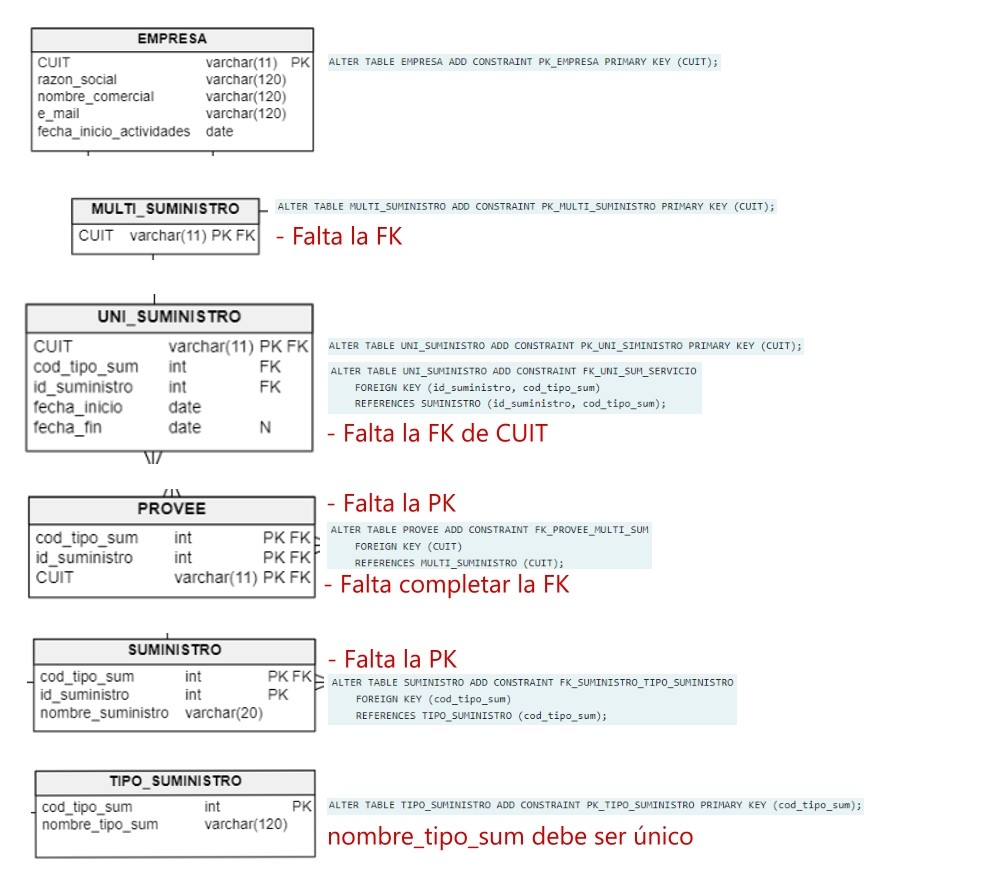

<h1>Consigna 1</h1>

Dado el esquema de la figura


Si las foreign key fueran las que se indican debajo y se encuentran cargados los siguientes datos:


```SQL
DELETE FROM TIPO_SERVICIO WHERE codigo_tipo_serv =’C’;  -- Procede
/*La pk "cod_tipo_serv" de la tabla "tipo_servicio" esta referenciada en la tabla "servicio", cuya acción referencial 
para un delete es de tipo CASCADE. Además, si bien la columna "cod_tipo_serv" esta referenciada en la tabla "uni_serv", 
el registro en particular cuyo codigo_tipo_serv =’C’, no existe en esta tabla.*/

UPDATE TIPO_SERVICIO SET codigo_tipo_serv =’F’ WHERE codigo_tipo_serv =’B’;  -- Falla
/*Si quisieramos cambiar la B por F, no se podria ya que la tabla que la referencia (servicio) tiene definida su acción 
referencial como RESTRICT para los casos de UPDATE.*/

DELETE FROM TIPO_SERVICIO WHERE codigo_tipo_serv =’B’  -- Falla
/*La tabla "servicio" tiene definida su acción referencial como CASCADE para los casos de DELETE. PERO La tabla "uni_serv" 
tiene definida su acción referencial como RESTRICT para los casos de DELETE.*/

UPDATE SERVICIO SET id_servicio = 5 WHERE codigo_tipo_serv =’E’;  -- Procede
/*La tabla referenciante "uni_serv" tiene su acción referencial definida como CASCADE para los UPDATE. Serían dos campos
de dos registros los que se actualizarían en la tabla  "uni_serv" y que quedarian iguales, pero no nos genera problema ya
que no son PK.*/

DELETE FROM SERVICIO WHERE id_servicio = 1;  -- Falla
/*uni_serv referencia la columna id_servicio de la tabla "servicio", y su acción referencial esta definida como RESTRICT
para los casos de DELETE.*/

DELETE FROM UNI_SERV WHERE DNI = ’41597842’;  -- Procede
/*Esa columna no esta referenciada por ninguna de las otras tablas (que tomamos en cuenta para este ejercicio)*/
```

<h1>Consigna 2</h1>
Utilizando el esquema unc_esq_peliculas. Contar todos los distribuidores nacionales cuyo teléfono empiece con 23.

1. Ninguna de las opciones es correcta
2. 0
3. 135
4. $\color{YellowGreen}{7}$
5. 120

```SQL
--Usando solo la tabla distribuidor
SELECT COUNT(id_distribuidor)
FROM distribuidor
WHERE tipo = 'N'
AND telefono ILIKE '23%';

--Usando distribuidor y nacional
SELECT COUNT(id_distribuidor)
FROM distribuidor
WHERE telefono ILIKE '23%'
AND id_distribuidor IN (
    SELECT id_distribuidor FROM nacional
    );
```



<h1>Consigna 3</h1>
Utilizando el esquema unc_esq_voluntario. De qué país(nombre) hay mayor cantidad de voluntarios que realizan una tarea terminada en REP.

1. $\color{YellowGreen}{Reino\ Unido}$

2. Ninguna de las opciones es correcta

3. Canadá

4. Estados Unidos 

5. Alemania

```SQL
-- 1 opción
SELECT p.nombre_pais, COUNT(v.nro_voluntario) AS cant_voluntarios
FROM pais p
JOIN direccion d ON p.id_pais = d.id_pais
JOIN institucion i ON d.id_direccion = i.id_direccion
JOIN voluntario v ON i.id_institucion = v.id_institucion
WHERE id_tarea ILIKE '%REP'
GROUP BY p.nombre_pais
ORDER BY 2 DESC;

-- 2 opción (solo se cambia el ON por USING)
SELECT p.nombre_pais, COUNT(v.nro_voluntario) AS cant_voluntarios
FROM pais p
JOIN direccion d USING (id_pais)
JOIN institucion i USING (id_direccion)
JOIN voluntario v USING (id_institucion)
WHERE id_tarea ILIKE '%REP'
GROUP BY p.nombre_pais
ORDER BY 2 DESC;
```


<h1>Consigna 4</h1>


a) Este assertion comprueba que no existan registros de la tabla "trabaja_en" cuyos id_proyecto y cod_proyecto no se encuentren en la tabla directivo (esto verifica que no hayan empleados trabajando en proyectos sin directivo).

```SQL
CREATE ASSERTION control_directivo
    CHECK(NOT EXISTS(
        SELECT 1
        FROM trabaja_en
        WHERE (id_proyecto, cod_tipo_proy) NOT IN(
            SELECT id_proyecto, cod_tipo_proy
            FROM directivo
        )
    ));
/*Un proyecto donde trabaja gente (tabla: trabaja_en), y tiene directivo (tabla: directivo),
 es aquel proyecto que aparece en ambas tablas*/
```

b) Solución procedural utilizando triggers

```SQL
CREATE OR REPLACE FUNCTION fn_control_directivo_trabajadores() RETURNS TRIGGER AS $$
    BEGIN
        IF NOT EXISTS(
            SELECT 1
            FROM directivo d
            WHERE NEW.id_proyecto = d.id_proyecto
            AND NEW.cod_tipo_proy = d.cod_tipo_proy
        ) THEN
            RAISE EXCEPTION 'El proyecto con id: % y código de proyecto: %, no tiene un directivo que lo gestione', NEW.id_proyecto, NEW.cod_tipo_proy;
        END IF;
        RETURN NEW;
    END $$
    LANGUAGE plpgsql;

-- Tabla: trabaja_en
CREATE OR REPLACE TRIGGER tr_control_directivo_trabajadores
    BEFORE INSERT OR UPDATE OF cod_tipo_proy, id_proyecto ON trabaja_en
    FOR EACH ROW
    EXECUTE FUNCTION fn_control_directivo_trabajadores();
/*Solo tomo en cuenta los casos de update e insert ya que sobre lo que ya hay en la tabla (un 
proyecto con al menos un empleado)debemos verificar que exista un directivo que se encargue del mismo*/

CREATE OR REPLACE FUNCTION fn_control_directivo() RETURNS TRIGGER AS $$
    BEGIN
        IF (TG_OP = 'UPDATE') THEN
            cod_proy := OLD.cod_tipo_proy;
            id_proy := OLD.id_proyecto;
        ELSE
            cod_proy := NEW.cod_tipo_proy;
            id_proy := NEW.id_proyecto;
        END IF;
        IF (EXISTS(
            SELECT 1
            FROM trabaja_en t
            WHERE (t.cod_tipo_proy, t.id_proyecto) = (cod_proy, id_proy)
        )) THEN
            RAISE EXCEPTION 'Los datos que está queriendo actualizar/eliminar no existen en la base de datos.';
        END IF;
        IF (TG_OP = 'DELETE') THEN
            RETURN OLD;
        END IF;
        RETURN NEW;
    END $$
    LANGUAGE plpgsql;

-- Tabla: directivo
CREATE OR REPLACE TRIGGER tr_control_directivo
    BEFORE DELETE OR UPDATE OF id_proyecto, cod_tipo_proy ON directivo
    FOR EACH ROW
    EXECUTE FUNCTION fn_control_directivo();
/*Como id_proyecto y cod_tipo_proy son FK, no es necesario corroborar en el INSERT que los campos
mencionados coincidan con los de algún registro de la tabla trabaja_en*/ 
```

> [!IMPORTANT]
> Otra opción para resolver el trigger anterior (no esta checkeada ya que se nos ocurrió al ver la resolución de otro parcial):
> 
> ```SQL
> CREATE OR REPLACE FUNCTION fn_control_directivo RETURNS TRIGGER AS $$
> BEGIN
>    IF EXISTS(
>         SELECT 1
>         FROM trabaja_en t
>         WHERE t.id_proyecto = OLD.id.proyecto
>         AND t.cod_tipo_proy = OLD.cod_tipo_proy
>     ) 
>     AND NOT EXISTS(
>         SELECT 1
>         FROM directivo d
>         WHERE d.id_proyecto = OLD.id_proyecto
>         AND d.cod_tipo_proy = OLD.cod_tipo_proy 
>     ) THEN
>         RAISE EXCEPTION 'No hay un directivo asignado al proyecto cuyo id es % y su código es %', OLD.id_proyecto, OLD.cod_tipo_proy;
>     RETURN NEW;
> END $$
> LANGUAGE plpgsql;
> 
> CREATE OR REPLACE TRIGGER tr_control_directivo
>     AFTER DELETE OR UPDATE OF id_proyecto, cod_tipo_proy ON DIRECTIVO
>     FOR EACH ROW
>     EXECUTE FUNCTION fn_control_directivo();
> ```

<h1>Consigna 5</h1>


<h3>Ayuda visual</h3>
Imagen con cada tabla y las definiciones dadas por la cátedra para ver más claramente las claves faltantes.


```SQL
-- Declaración de claves faltantes para tabla "multi_suministro".
ALTER TABLE multi_suministro
ADD CONSTRAINT FK_multi_suministro_empresa
FOREIGN KEY (CUIT)
REFERENCES empresa (CUIT)
ON DELETE CASCADE
ON UPDATE CASCADE;

-- Declaración de claves faltantes para tabla "uni_suministro".
ALTER TABLE uni_suministro
ADD CONSTRAINT FK_uni_suministro_empresa
FOREIGN KEY (CUIT)
REFERENCES empresa (CUIT)
ON DELETE CASCADE
ON UPDATE CASCADE;

-- Declaración de claves faltantes para tabla "provee".
ALTER TABLE provee
ADD CONSTRAINT FK_provee_suministro
FOREIGN KEY (id_suministro, cod_tipo_sum)
REFERENCES suministro (id_suministro, cod_tipo_sum);

ALTER TABLE provee
ADD CONSTRAINT PK_provee
PRIMARY KEY (CUIT, id_suministro, cod_tipo_sum);

-- Declaración de claves faltantes para tabla "suministro".
ALTER TABLE suministro
ADD CONSTRAINT PK_suministro
PRIMARY KEY (id_suministro, cod_tipo_sum);

-- Declaración de claves faltantes para tabla "tipo_suministro".
ALTER TABLE tipo_suministro
ADD CONSTRAINT AK_tipo_suministro
UNIQUE (nombre_tipo_sum);
```

<h1>Consigna 6</h1>


Para el esquema de la figura y dadas las siguientes definiciones de vistas:

```SQL
CREATE OR REPLACE VIEW v_gmail
AS
SELECT DNI, email, apellido, nombre, fecha_nac 
FROM persona
WHERE email like '%gmail%';
 
CREATE OR REPLACE VIEW v_gmail_mayor
AS
SELECT *
FROM v_gmail
WHERE DNI > 23456789
WITH LOCAL CHECK OPTION;
 
CREATE OR REPLACE VIEW v_gmail_parcial
AS
SELECT *
FROM v_gmail_mayor
WHERE apellido like 'Bet%'
WITH CASCADED CHECK OPTION;
```

Para las siguientes sentencias ejecutadas de manera independiente señalar las opciones que son FALSAS. Nota: Las respuestas incorrectas restan del puntaje total. Tenga cuidado al cortar y pegar las sentencias con las comillas simples ' '.

a) Procede, inserta los datos en la tabla persona y se muestran en la vista v_gmail y en la vista v_gmail_mayor

```SQL
INSERT INTO v_gmail_mayor (DNI, email, apellido, nombre, fecha_nac)
VALUES (33456789, ‘cc@gmail.com’, ‘Beta’, ‘J’, to_date('20170103','YYYYMMDD'))
```
- [ ] Verdadera. Cumple con la condición de la vista v_gmail_parcial, también cumple con la condición de la vista padre, v_gmail_mayor; y cumple con la condición de la vista padre de la última, v_gmail.

> [!CAUTION]
> Corrección de la cátedra sobre el punto anterior -> Falsa: Procede, inserta los datos en la tabla persona y se muestran en todas las vistas.

b) Procede, inserta los datos en la tabla persona pero no se muestran en la vista v_gmail

```SQL
INSERT INTO v_gmail_mayor (DNI, email, apellido, nombre, fecha_nac)
VALUES (33456789, ‘cc@hotmail.com’, ‘Beta’, ‘J’, to_date('20170103','YYYYMMDD'))
```

- [ ] Verdadera. Cumple con la condición de la vista v_gmail_mayor, pero no cumple con la condición de la vista padre de la última, v_gmail. Como v_gmail no tiene la cláusula WITH CHECK OPTION, permite que se realice el INSERT pero cuando haga el SELECT de los datos que cumplan la condición, el elemento añadido no la cumplirá, con lo que no se lo mostrará en la vista.

c) NO Procede, da error.

```SQL
INSERT INTO v_gmail_mayor (DNI, email, apellido, nombre, fecha_nac)
VALUES (33456789, ‘cc@hotmail.com’, ‘Beta’, ‘J’, to_date('20170103','YYYYMMDD'))
```

- [X] Falsa. Cumple con las condiciones de las vistas v_gmail_mayor y v_gmail. Sin embargo, no cumple con la condición de v_gmail. De igual manera, se nos permitirá hacer el INSERT (ya que la tabla v_gmail no tiene cláusula WITH CHECK OPTION) pero este nuevo dato no se mostrará en las vistas.

d) Procede, inserta los datos en la tabla persona pero no se muestran en la vista v_gmai mayor

```SQL
INSERT INTO vgmail_mayor (DNI, email, apellido, nombre, fecha_nac)
VALUES (33456789, ‘cc@hotmail.com’, ‘Beta’, ‘J’, to_date('20170103','YYYYMMDD'))
```

- [ ] Verdadero. Cumple con las condiciones de v_gmail_mayor, pero no con las condiciones de v_gmail. Sin embargo, como v_gmail no tiene cláusula CHECK OPTION, permite hacer el INSERT. Esto provocará que cuando se realice el SELECT de los registro de persona, el mismo no estará en la vista v_gmail ya que no cumple con su condición. Así mismo, tampoco formará parte de la vista v_gmail_mayor (ya que al no estar en la vista en la que se basa, tampoco estará en esta).

e) NO Procede, porque no cumple con la condición de la vista v_gmail

```SQL
INSERT INTO v_gmail_mayor (DNI, email, apellido, nombre, fecha_nac)
VALUES (33456789, ‘cc@hotmail.com’, ‘Beta’, ‘J’, to_date('20170103','YYYYMMDD'))
```

- [X] Falsa. Procede con el INSERT pero no se mostrará en las vistas.

f) Procede, inserta los datos en la tabla persona y se muestran en todas las vistas

```SQL
INSERT INTO v_gmail_mayor (DNI, email, apellido, nombre, fecha_nac)
VALUES (33456789, ‘cc@ hotmail.com’, ‘Beta’, ‘J’, to_date('20170103','YYYYMMDD'))
```

- [X] Falsa. Cumple con la condición de v_gmail_mayor, pero no con la condición de la vista v_gmail. Con lo que el elemento nuevo se insertará, pero no se mostrará en ninguna de las vistas.

<h1>Extras</h1>

Scripts de creación de las tablas

```SQL
-- tables
-- Table: DIRECTIVO
CREATE TABLE DIRECTIVO (
    DNI int  NOT NULL,
    cod_tipo_proy int  NOT NULL,
    id_proyecto int  NOT NULL,
    fecha_inicio date  NOT NULL,
    fecha_fin date  NULL
);

-- Table: EMPLEADO
CREATE TABLE EMPLEADO (
    DNI int  NOT NULL,
    e_mail varchar(120)  NOT NULL,
    apellido varchar(40)  NOT NULL,
    nombre varchar(40)  NOT NULL,
    fecha_nac date  NOT NULL,
    CONSTRAINT AK_EMPLEADO UNIQUE (e_mail) NOT DEFERRABLE  INITIALLY IMMEDIATE
);

-- Table: PROYECTO
CREATE TABLE PROYECTO (
    cod_tipo_proy int  NOT NULL,
    id_proyecto int  NOT NULL,
    nombre_proyecto varchar(120)  NOT NULL    
);

-- Table: TECNICO
CREATE TABLE TECNICO (
    DNI int  NOT NULL    
);

-- Table: TIPO_PROYECTO
CREATE TABLE TIPO_PROYECTO (
    cod_tipo_proy int  NOT NULL,
    nombre_tipo_proy varchar(40)  NOT NULL,
    descripcion_tipo_proy text  NOT NULL,
    CONSTRAINT AK_TIPO_PROYECTO UNIQUE (nombre_tipo_proy) NOT DEFERRABLE  INITIALLY IMMEDIATE
);

-- Table: TRABAJA_EN
CREATE TABLE TRABAJA_EN (
    cod_tipo_proy int  NOT NULL,
    id_proyecto int  NOT NULL,
    DNI int  NOT NULL
);
```