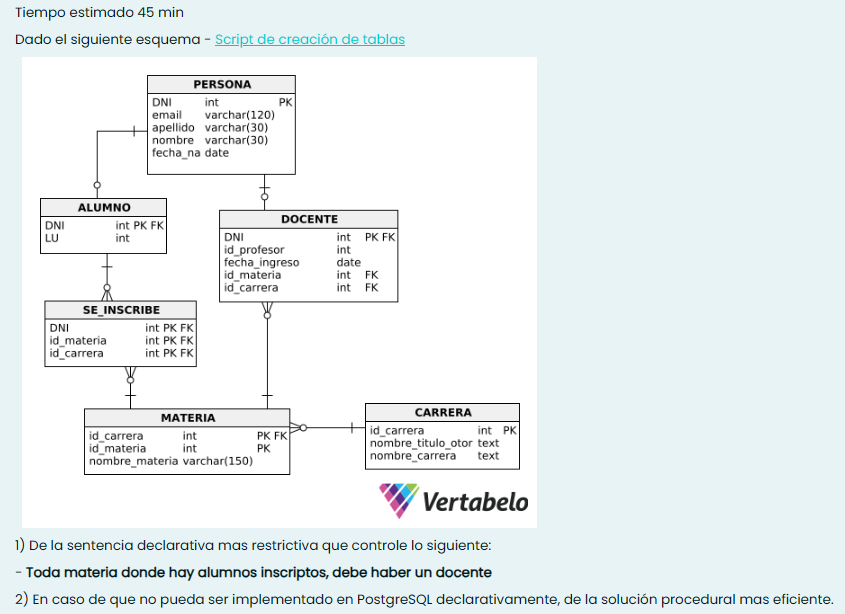

<h1>Consigna 1</h1>



a) Assertion (sentencia declarativa) evalue que no existan registros de la tabla "se_inscribe", donde los campos "id_materia" e "id_carrera" no coincidan con los de algún registro en la tabla de "docente".

```SQL
CREATE ASSERTION control_materias_y_docentes
    CHECK( NOT EXISTS(
        SELECT 1
        FROM se_inscribe
        WHERE (id_materia, id_carrera) NOT IN(
            SELECT id_materia, id_carrera
            FROM docente
        )
    ))
```

b) Trigger (sentencia procedural).

```SQL
-- verificar UPDATE y DELETE en tabla docente
-- verificar INSERT y UPDATE en la tabla se_inscribe

CREATE OR REPLACE FUNCTION fn_control_inscriptos() RETURNS TRIGGER AS $$
    BEGIN
        IF NOT EXISTS(
            SELECT 1
            FROM docente
            WHERE (id_materia, id_carrera) IN (NEW.id_materia, NEW.id_carrera)
        ) THEN
            RAISE EXCEPTION 'No hay un docente asignado a la materia % en la carrera %', NEW.id_materia, NEW.id_carrera;
        END IF;
        RETURN NEW;
    END $$
    LANGUAGE plpgsql;

CREATE OR REPLACE TRIGGER tr_control_inscriptos
    BEFORE INSERT OR UPDATE OF id_materia, id_carrera ON se_inscribe
    FOR EACH ROW
    EXECUTE FUNCTION fn_control_incriptos();

CREATE OR REPLACE FUNCTION fn_control_docentes() RETURNS TRIGGER AS $$
    DECLARE
    BEGIN
        IF EXISTS(
            SELECT 1
            FROM se_inscribe i
            WHERE i.id_materia = OLD.id_materia
            AND i.id_carrera = OLD.id_materia
        )
        AND NOT EXISTS(
            SELECT 1
            FROM docente d
            WHERE d.id_materia = OLD.id_materia
            AND d.id_carrera = OLD.id_carrera
        ) THEN
            RAISE EXCEPTION 'No hay un docente asignado a la materia % en la carrera %', NEW.id_materia, NEW.id_carrera;
        END IF;
        RETURN NEW;
    END $$
    LANGUAGE plpgsql;

CREATE OR REPLACE TRIGGER tr_control_docentes
    AFTER DELETE OR UPDATE ON id_materia, id_carrera ON docente
    FOR EACH ROW
    EXECUTE FUNCTION fn_control_docentes();
```

