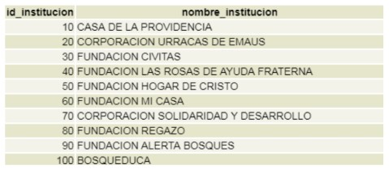
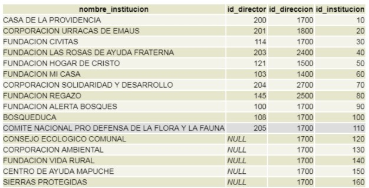
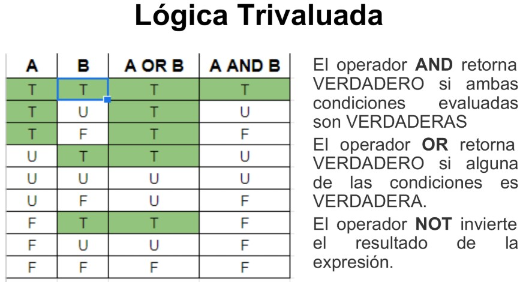
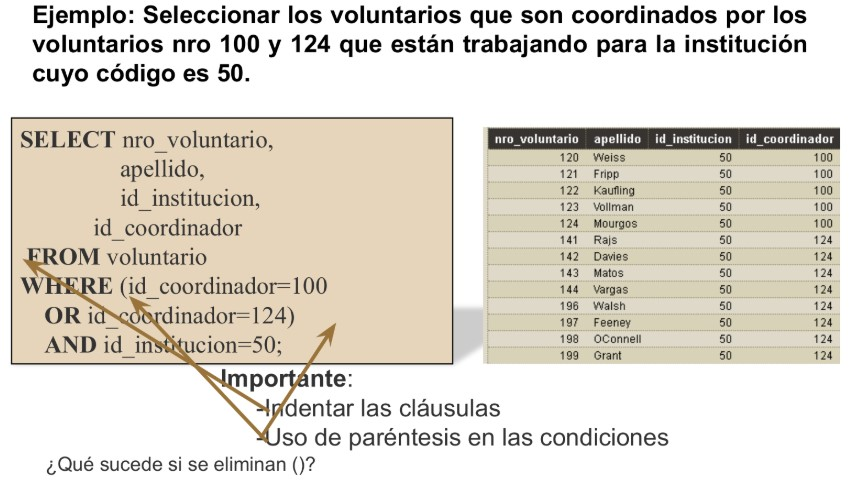
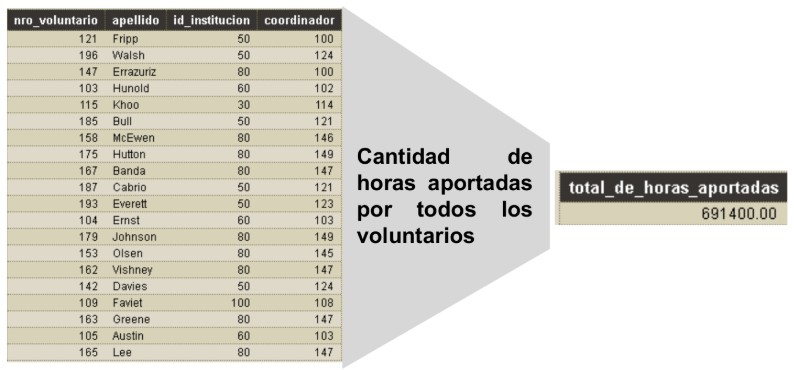

# Parte 1

## Consultas básicas

```SQL
SELECT * | { [DISTINCT] columna | expresión [alias],...}
FROM <lista tablas>
```

**`SELECT`** :arrow_right: Identifica las columnas a recuperar.

```SQL
SELECT id_institucion, nombre_institucion
FROM esq_vol_institucion;
```



**`SELECT *`** :arrow_right: Se usa para seleccionar todas las columnas de una tabla.

```SQL
SELECT *
FROM esq_vol_institucion;
```


**`FROM`** :arrow_right: Identifica la tabla de donde obtener los datos.

> [!NOTE]
> El resultado de una consulta es una tabla (si es un número, se considera como una tabla con una fila y una columna).

**`DISTINCT`** :arrow_right: elimina filas duplicadas de los resultados de una consulta, devolviendo solo valores únicos en las columnas seleccionadas. Por ejemplo, si quisieramos conocer todos los autores sin repetir de los cuales tenemos libros:

```SQL
    SELECT DISTINCT autor 
    FROM libros;
```

> [!IMPORTANT]
> La cláusula DISTINCT se aplica a todas las columnas de la lista en el SELECT. Ejemplo: seleccionar los voluntarios coordinadores y las distintas instituciones de los empleados coordinados.
>
> ```SQL
> SELECT DISTINCT id_institucion, id_coordinador
> FROM esq_vol_voluntario;
> ```

**`AS`** :arrow_right: Renombra el encabezamiento de una columna.

```SQL
SELECT nombre_tarea, max_horas – min_horas AS variacion
FROM tarea;
```

> [!IMPORTANT]
> * Si contiene espacios, caracteres especiales o es sensible a mayúsculas y minúsculas, se debe encerrar entre comillas dobles.
> * Operador de concatenación || para cadenas de caracteres
>
> ```SQL
> SELECT apellido || ‘,’ || nombre AS “Apellido,nombre”
> FROM voluntario;
> ```

## Operadores aritméticos

Una expresión aritmética puede contener nombres de columnas, valores numéricos constantes y operadores aritméticos.
Precedencia de los operadores:

1. Operaciones entre paréntesis.
2. La multiplicación y la división tienen prioridad sobre la suma y la resta

> [!IMPORTANT]
> Los operadores de idéntica prioridad se evalúan de izquierda a derecha.
>
> ```SQL
> SELECT nombre_tarea, 2 * max_horas – min_horas
> FROM tarea;
> ```
> 
> ```SQL
> SELECT nombre_tarea, 2 * (max_horas – min_horas)
> FROM tarea;
> ```

## Restringir y comparar resultado

```SQL
SELECT * | { [DISTINCT] columna | expresión [alias],...}
FROM <lista tablas>
[WHERE condición/es];
```

**`WHERE`** :arrow_right: se usa para filtrar los resultados de una consulta, devolviendo solo aquellas filas que cumplen una condición, la cual usa:

* Operadores de comparación (<, >, =, <=, >=, <> o !=)
* Operadores lógicos (AND, OR, NOT).

```SQL
SELECT nro_voluntario, nombre, apellido
FROM voluntario
WHERE id_institucion = 60;
```

El resultado de la comparación puede ser:

* Verdadero (T)
* Falso (F)
* Desconocido (U)

### Operadores de comparación especiales utilizados en conjunto con la cláusula WHERE

**`[NOT] BETWEEN`** :arrow_right: es un operador especial que filtra los registros dentro de un rango de valores, incluyendo los límites. Por ejemplo, seleccionar los voluntarios cuyo número se encuentra entre 100 y 120.

```SQL
SELECT * FROM voluntario
WHERE nro_voluntario BETWEEN 100 AND 120;
```

**Operadores de comparación de patrones** : se usan para buscar patrones en columnas de tipo texto.

* %: cualquier secuencia de cero o más caracteres
* _ : denota un solo carácter

**`[NOT] LIKE`** :arrow_right: distingue entre mayúsculas y minúsculas ('JUAN' ≠ 'juan').

**`[NOT] ILIKE`** :arrow_right: no distingue ('JUAN' = 'juan').

Ejemplo: Seleccionar los voluntarios cuya segunda letra del nombre sea a y luego tenga una n como carácter final.

```SQL
SELECT * FROM voluntario WHERE nombre LIKE ‘_a%n’;
```

**`IS [NOT] NULL`** :arrow_right: se utiliza para verificar si una columna tiene un valor nulo. Ejemplo: listar los datos completos de los voluntarios que no tengan coordinador.

```SQL
SELECT * FROM voluntario
WHERE id_coordinador IS NULL;
```

> [!NOTE]
> NULL es un valor inaccesible, sin valor, desconocido o inaplicable. No representa ni un cero ni un espacio en blanco (el cero es un
número y el espacio en blanco es un carácter).

### Condiciones de comparación compuestas

> [!NOTE]
> * Un operador lógico combina los resultados de dos condiciones para producir un único resultado basado en ellos, o invertir el resultado de una condición.
> * Al comparar dos valores nulos usando los operadores de comparación, el resultado será siempre DESCONOCIDO porque un valor nulo no puede ser igual, mayor, menor o distinto a otro valor nulo.





**RTA**: si no utilizamos los () obtendremos un resultado distinto. Esto se debe a que el operador AND tiene mayor prioridad que el OR, con lo que siguiendo el ejemplo anterior, si no utilizamos paréntesis primero se evaluará id_coordinador=124 AND id_institucion=50, y después aplicará el OR para comparar con id_coordinador=100.

### Operadores de pertenencia y existencia en conjunto con la cláusula WHERE

> [!CAUTION]
> Leer primero el apartado [Consultas Anidadas (Subconsultas)](#consultas-anidadas-subconsultas) para comprender mejor el uso de los sig operadores.

**`[NOT] IN`** :arrow_right: compara un valor (o columna) con una lista de posibles valores. Si el valor se encuentra en esa lista, la condición se evalúa como verdadera.

* Ejemplo con lista explícita:

```SQL
SELECT *
FROM empleados
WHERE depto IN (10, 20, 30);
```

Se seleccionan los empleados cuyo departamento es 10, 20 o 30.

* Ejemplo con subconsulta:

```SQL
SELECT nombre
FROM empleados
WHERE depto IN (
    SELECT depto
    FROM departamentos
    WHERE ubicacion = 'Madrid'
);
```

En este caso, la subconsulta retorna un conjunto de departamentos ubicados en Madrid y se seleccionan los empleados que pertenecen a alguno de esos departamentos.

> [!CAUTION]
> Tener presente que la subconsulta de un NOT IN puede retornar valores nulos.

**`[NOT] EXISTS`** :arrow_right: evalúa la subconsulta y devuelve TRUE si la subconsulta retorna uno o más registros; de lo contrario, devuelve FALSE. No importa qué datos específicos se retornen, solo interesa la existencia de filas.

```SQL
SELECT nombre
FROM empleados e
WHERE EXISTS (
    SELECT 1
    FROM departamentos d
    WHERE d.depto = e.depto AND d.ubicacion = 'Madrid'
);
```

Para cada empleado, la subconsulta comprueba si existe al menos un departamento que tenga la misma clave de departamento y que esté en Madrid. Si la subconsulta retorna al menos una fila, el empleado se incluye en el resultado.

## Orden y paginación de registros con LIMIT y OFFSET

> [!IMPORTANT]
> Si no se lo especifica, el orden de las filas listadas en una consulta es indefinido.

**`ORDER BY`** :arrow_right: Ordena las filas de resultados de una consulta de forma ascendente (ASC) o descendente (DESC).

* Ubicación: ORDER BY se debe colocar como última cláusula de la sentencia SELECT.
* Orden predeterminado: si no se especifica un orden, se utiliza de manera predeterminada el orden ascendente.
* Sintaxis: la directriz de orden (ASC o DESC) se coloca justo después del nombre de la columna.
* Ordenamiento múltiple: Es posible ordenar los resultados por más de una columna, definiendo el orden para cada una de ellas.

Ejemplo: listar los apellidos ordenados descendentemente y nombres de los voluntarios que son coordinados por el voluntario 124.

```SQL
SELECT apellido, nombre
FROM voluntario
WHERE id_coordinador=124
ORDER BY apellido DESC, nombre;
```

**`LIMIT`** :arrow_right: limita la cantidad de filas a retornar.

**`OFFSET`** :arrow_right: omite un número dado de filas desde el inicio del conjunto de resultados antes de devolver las filas especificadas por LIMIT.

> [!IMPORTANT]
> LIMIT y OFFSET deben ser utilizados siempre con la cláusula ORDER BY

```SQL
SELECT lista de atributos
FROM tabla/s
[ORDER BY ... ]
[LIMIT { número | ALL}]
[OFFSET número];
```

Ejemplo 1: seleccionar los datos de los voluntarios que corresponden a los 10 primeros voluntarios.

```SQL
SELECT *
FROM voluntario
ORDER BY nro_voluntario
LIMIT 10;
```

Ejemplo 2: seleccionar los datos de los voluntarios a partir del 15TO voluntario.

```SQL
SELECT *
FROM voluntario
ORDER BY nro_voluntario
LIMIT ALL
OFFSET 15;
```

## Funciones de grupo

Operan sobre un conjunto de filas y devuelven un único valor.



* **`SUM()`**: suma todos los valores de una columna numérica.
* **`AVG()`**: calcula el promedio de los valores de una columna numérica.
* **`MAX()`**: obtiene el valor máximo de una columna.
* **`MIN()`**: obtiene el valor mínimo de una columna.
* **`COUNT()`**: cuenta el número de filas.
* **`COALESCE(columna, valor_reemplazo)`**: evalúa la columna especificada y devuelve su valor si este no es NULL; en caso contrario, devuelve el valor de reemplazo indicado.

```SQL
SELECT [columna, ...] función de grupo(columna), ...
FROM tabla/s
[WHERE condición/es]
```

Ejemplo 1: seleccionar el voluntario más joven y el más viejo.

```SQL
SELECT 
    MAX(fecha_nacimiento) AS voluntario_mas_joven,
    MIN(fecha_nacimiento) AS voluntario_mas_viejo
FROM voluntario;
```

Ejemplo 2: liste el número de ciudades en la tabla dirección, excluyendo los valores nulos.

```SQL
SELECT COUNT(ciudad) AS cantidad__de_ciudades
FROM direccion;
```

Ejemplo 3:

```SQL
SELECT AVG(COALESCE(porcentaje, 0)) AS Porcentaje_promedio
FROM voluntario;
```

> [!IMPORTANT]
> Las funciones de grupo ignoran los valores nulos (a excepción de la función COALESCE por supuesto).

## Selección de grupos de datos

**`GROUP BY`** :arrow_right: agrupa filas que tienen valores idénticos en una o varias columnas.

```SQL
SELECT lista columnas, función de grupo (columna)
FROM <lista tablas>
[ WHERE condición ]
[ GROUP BY expresión de grupo | lista columnas ]
[ ORDER BY <lista atributos orden> ];
```

Ejemplo 1: find the number of customers in each country.

```SQL
SELECT COUNT(CustomerID), Country
FROM Customers
GROUP BY Country;
```

| Country | COUNT(CustomerID) |
|---------|-------------------|
| USA     | 90                |
| Canada  | 35                |
| UK      | 50                |
| Mexico  | 20                |

Ejemplo 2: obtener el número de empleados y el salario promedio por departamento.

```SQL
SELECT departamento, 
    COUNT(*) AS total_empleados, 
    AVG(salario) AS salario_promedio
FROM empleados
GROUP BY departamento;
```

| departamento | total_empleados | salario_promedio |
|--------------|-----------------|------------------|
| Ventas       | 20              | 55,000           |
| Finanzas     | 10              | 60,000           |
| TI           | 15              | 70,000           |
| Marketing    | 8               | 52,500           |

> [!IMPORTANT]
> * Todas las columnas de la lista SELECT, excepto las funciones de grupo, deben estar en la cláusula GROUP BY.
> 
> ```SQL
> SELECT id_institucion, MAX(horas_aportadas)
> FROM voluntario
> GROUP BY id_institucion;
> ```
> 
> * Las columnas en la cláusula GROUP BY pueden no estar en la lista del SELECT.
> 
> ```SQL
> SELECT AVG(porcentaje)
> FROM voluntario
> GROUP BY id_institucion;
> ```

### Uso de GROUP BY con funciones de grupo

Las funciones de grupo se suelen utilizar junto con la cláusula GROUP BY para aplicar el cálculo de forma separada a grupos de filas. Por ejemplo, si deseas calcular el salario promedio por departamento:

```SQL
SELECT departamento, AVG(salario) AS salario_promedio
FROM empleados
GROUP BY departamento;
```

### Restringir los resultados de los grupos

**`HAVING`** :arrow_right: filtra los resultados de grupos generados por la cláusula GROUP BY.

**Diferencia entre WHERE y HAVING**
* **WHERE**:
Se aplica antes de agrupar los datos. Filtra las filas individuales según una condición.

* **HAVING**:
Se aplica después de agrupar los datos. Filtra los grupos creados por GROUP BY según condiciones que a menudo involucran funciones de agregación (como COUNT(), SUM(), AVG(), etc.).

> [!CAUTION]
> * No se puede utilizar la cláusula WHERE para restringir grupos.
> * No se pueden utilizar funciones de grupo en la cláusula WHERE.
> 
> ```SQL
> SELECT id_coordinador, 
>     COUNT(*) AS cantidad_de_voluntarios
> FROM voluntario
> WHERE COUNT(*) > 7
> GROUP BY id_coordinador;
> ```

# Parte 2

## Ensambles (JOIN)

**Employees**

| EmployeeID | Name   | DepartmentID |
|------------|--------|--------------|
| 1          | Alice  | 10           |
| 2          | Bob    | 20           |
| 3          | Carol  | 40           |

**Departments**

| DepartmentID | DepartmentName |
|--------------|----------------|
| 10           | HR             |
| 20           | IT             |
| 30           | Marketing      |

> [!IMPORTANT]
> Todas las operaciones de JOIN se realizan de izquierda a derecha.

**`INNER JOIN / JOIN`** :arrow_right: Returns records that have matching values in both tables.

Consulta SQL:

```SQL
SELECT e.EmployeeID, e.Name, d.DepartmentName
FROM Employees e
INNER JOIN Departments d ON e.DepartmentID = d.DepartmentID;
```

Resultado esperado:

| EmployeeID | Name  | DepartmentName |
|------------|-------|----------------|
| 1          | Alice | HR             |
| 2          | Bob   | IT             |

**`LEFT JOIN`** :arrow_right: Returns all records from the left table, and the matched records from the right table.

Consulta SQL:

```SQL
SELECT e.EmployeeID, e.Name, d.DepartmentName
FROM Employees e
LEFT JOIN Departments d ON e.DepartmentID = d.DepartmentID;
```

Resultado esperado:

| EmployeeID | Name  | DepartmentName |
|------------|-------|----------------|
| 1          | Alice | HR             |
| 2          | Bob   | IT             |
| 3          | Carol | NULL           |

**`RIGHT JOIN`** :arrow_right: Returns all records from the right table, and the matched records from the left table.

Consulta SQL:

```SQL
SELECT e.EmployeeID, e.Name, d.DepartmentName
FROM Employees e
RIGHT JOIN Departments d ON e.DepartmentID = d.DepartmentID;
```

Resultado esperado:

| EmployeeID | Name  | DepartmentName |
|------------|-------|----------------|
| 1          | Alice | HR             |
| 2          | Bob   | IT             |
| NULL       | NULL  | Marketing      |

**`FULL JOIN`** :arrow_right: Returns all records when there is a match in either left or right table. Si no hay coincidencia en alguna de las tablas, se muestran NULL en los campos correspondientes.

Consulta SQL:

```SQL
SELECT e.EmployeeID, e.Name, d.DepartmentName
FROM Employees e
FULL JOIN Departments d ON e.DepartmentID = d.DepartmentID;
```

Resultado esperado:

| EmployeeID | Name  | DepartmentName |
|------------|-------|----------------|
| 1          | Alice | HR             |
| 2          | Bob   | IT             |
| 3          | Carol | NULL           |
| NULL       | NULL  | Marketing      |

**`NATURAL JOIN`** :arrow_right: Realiza la unión de dos tablas de manera automática basándose en las columnas con el mismo nombre y tipo de datos en ambas tablas. No necesitas especificar la condición del join.

Consulta SQL:

```SQL
SELECT EmployeeID, Name, DepartmentID, DepartmentName
FROM Employees
NATURAL JOIN Departments;
```

Resultado esperado:

| EmployeeID | Name  | DepartmentID | DepartmentName |
|------------|-------|--------------|----------------|
| 1          | Alice | 10           | HR             |
| 2          | Bob   | 20           | IT             |

> [!NOTE]
> **Multiple JOIN**
> ```SQL
> SELECT v.apellido, v.nombre FROM voluntario v 
> INNER JOIN tarea t ON v.id_tarea = t.id_tarea
> INNER JOIN institucion i ON v.id_institucion = i.id_institucion;
> ```
> 
> 1. Las tablas del primer JOIN coinciden (tablas voluntario y tarea). Como resultado, se crea una tabla intermedia.
> 2. Esta tabla intermedia (tratada como la tabla izquierda) se une con la otra tabla (tabla institución) utilizando el segundo JOIN.

## Consultas Anidadas (Subconsultas)

1. **Subconsultas que devuelven un único valor**
Se emplean cuando se espera que la subconsulta retorne un solo resultado. Este valor único se suele utilizar en la consulta principal para realizar comparaciones (por ejemplo, con operadores como =, >, <).

Ejemplo 1:

```SQL
SELECT nombre, salario
FROM empleados
WHERE salario > (
    SELECT AVG(salario) 
    FROM empleados
    );
```

Ejemplo 2: Se desea seleccionar los voluntarios que realizan la misma tarea que el voluntario 141 y que aportan más horas que el voluntario 143.

```SQL
SELECT nombre, id_tarea, horas_aportadas
FROM voluntario
WHERE id_tarea = (
    SELECT id_tarea 
    FROM voluntario 
    WHERE id_voluntario = 141
    )
AND horas_aportadas > (
    SELECT horas_aportadas 
    FROM voluntario 
    WHERE id_voluntario = 143
    );
```

> [!CAUTION]
> Ejemplo erróneo: Seleccionar el nombre de la/s instituciones del estado (provincia) de Texas.
> 
> ```SQL
> SELECT nombre_institucion
> FROM institucion i
> WHERE i.id_direccion = (
>     SELECT id_direccion
>     FROM direccion d
>     WHERE d.provincia = 'Texas'
>     );
> ```
> Si existen varias filas en la tabla direccion que cumplan con la condición d.provincia = 'Texas', la subconsulta devolverá múltiples valores. Esto provocará un error en SQL, porque el operador = espera comparar un solo valor, no una lista.


2. **Subconsultas que devuelven un conjunto de valores**
Se utilizan cuando se necesita comparar un valor con una lista de resultados generada por otra consulta. En estos casos, la subconsulta retorna múltiples valores y se emplean operadores como IN, ANY o ALL para evaluar si el valor de la consulta externa cumple ciertas condiciones en relación con la lista resultante.

```SQL
SELECT nombre, depto
FROM empleados
WHERE depto IN (
    SELECT depto 
    FROM departamentos 
    WHERE ubicacion = 'Madrid'
    );
```

3. Subconsultas correlacionadas
Cada subconsulta se ejecuta una vez por cada fila de la consulta externa.

```SQL
SELECT e.nombre, e.salario, e.depto
FROM empleados e
WHERE e.salario > (
    SELECT AVG(e2.salario)
    FROM empleados e2
    WHERE e2.depto = e.depto
);
```

### Diferencia entre subconsulta correlacionada y subconsulta no correlacionada

* **Subconsulta No Correlacionada:**
    * Se ejecuta una sola vez.
    * No hace referencia a columnas de la consulta externa.
    * Ejemplo:

```SQL
SELECT nombre, salario
FROM empleados
WHERE salario > (SELECT AVG(salario) FROM empleados);
```

**¿Por qué no está correlacionada?**
La subconsulta (SELECT AVG(salario) FROM empleados) no depende de ninguna columna de la consulta externa; simplemente calcula el promedio de todos los salarios y devuelve un único valor.

* **Subconsulta Correlacionada:**
    * Se ejecuta para cada fila de la consulta externa.
    * Depende de columnas de la consulta externa.
    * Ejemplo:

```SQL
SELECT e.nombre, e.salario, e.depto
FROM empleados e
WHERE e.salario > (
    SELECT AVG(e2.salario)
    FROM empleados e2
    WHERE e2.depto = e.depto
);
```

**¿Por qué está correlacionada?**
La subconsulta hace referencia a e.depto, que es una columna de la consulta externa (alias e). Esto implica que para cada fila de la tabla empleados en la consulta externa, la subconsulta se ejecuta utilizando el valor de depto correspondiente.

> [!NOTE]
> Operadores utilizados en subconsultas (IN y EXISTS) explicados en la seccion [Operadores de pertenencia y existencia en conjunto con la cláusula WHERE](#operadores-de-pertenencia-y-existencia-en-conjunto-con-la-cláusula-where)

## Operadores de conjuntos: UNION, INTERSECT y EXCEPT

Las cláusulas UNION, INTERSECT y EXCEPT se utilizan para combinar (o comparar) los resultados de dos o más consultas. A diferencia de los JOIN, que combinan columnas de diferentes tablas basándose en relaciones.

Es obligatorio que los resultados que buscamos combinar posean:

* Mismo número de columnas.
* Tipos de datos compatibles en cada columna correspondiente (no es necesario que el nombre de la columna sea el mismo, solo que el tipo de dato en la columna sea el mismo).
* El mismo orden de columnas en ambas consultas.

**`UNION`** :arrow_right: combina el resultado de dos consultas y devuelve todas las filas únicas (elimina duplicados).

```SQL
SELECT nombre FROM empleados
UNION
SELECT nombre FROM clientes;
```

Esto devolverá una lista de nombres que aparezcan en empleados o clientes, sin repetir.

**`INTERSECT`** :arrow_right: devuelve únicamente las filas que se encuentran en el resultado de ambas consultas.

```SQL
SELECT nombre FROM empleados
INTERSECT
SELECT nombre FROM clientes;
```

Esto devolverá los nombres que están presentes tanto en empleados como en clientes.

**`EXCEPT`** :arrow_right: devuelve las filas que aparecen en la primera consulta pero no en la segunda.

```SQL
SELECT nombre FROM empleados
EXCEPT
SELECT nombre FROM clientes;
```

Esto devuelve los nombres que se encuentran en empleados y que no están en clientes.

# Tips e Información Útil

### Buenas prácticas

* Las cláusulas de la sentencias suelen colocarse en líneas separadas y con sangría, para mejorar la legibilidad.
* Se estila escribir con MAYÚSCULAS las palabras reservadas y con minúsculas el resto.

```SQL
SELECT mi_atributo
FROM mi_tabla;
```

### Orden de ejecución de una consulta SQL en el DBMS

1. **FROM**
    * Determina sobre qué tablas, vistas o subconsultas debe operar. Si hay múltiples tablas se resuelven los JOINs, combinando tablas según la relación indicada (INNER JOIN, FULL JOIN, etc).
    * Esta fase establece el universo de datos.

2. **WHERE**
    * Después de tener el conjunto inicial, se filtran los datos con la cláusula WHERE, dejando solo las filas que cumplan las condiciones especificadas.

3. **GROUP BY**
    * Organiza las filas en grupos basados en una o varias columnas.

4. **HAVING**
    * Después de agrupar, HAVING filtra esos grupos basándose en las condiciones dadas.

5. **Proyectar el SELECT**
    * Se eligen las columnas o expresiones a devolver al usuario. Es en este punto donde se aplican las funciones agregadas.
    * Define el formato y contenido final del resultado.

6. **Evaluar la cláusula DISTINCT**
    * Si se especifica DISTINCT, se eliminan los registros duplicados en el resultado final.

7. **ORDER BY**
    * Ordena los resultados finales según una o varias columnas, de forma ascendente (ASC) o descendente (DESC).

8. **Aplicar LIMIT / OFFSET**
    * LIMIT: Restringe la cantidad de filas devueltas.
    * OFFSET: Indica desde qué fila comenzar a mostrar los resultados.