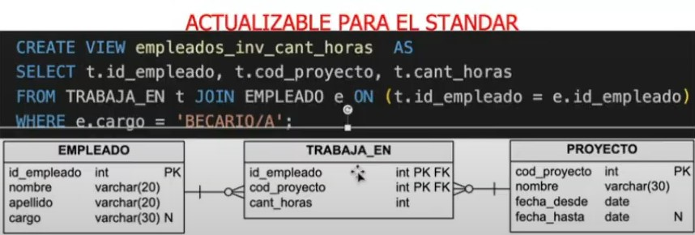
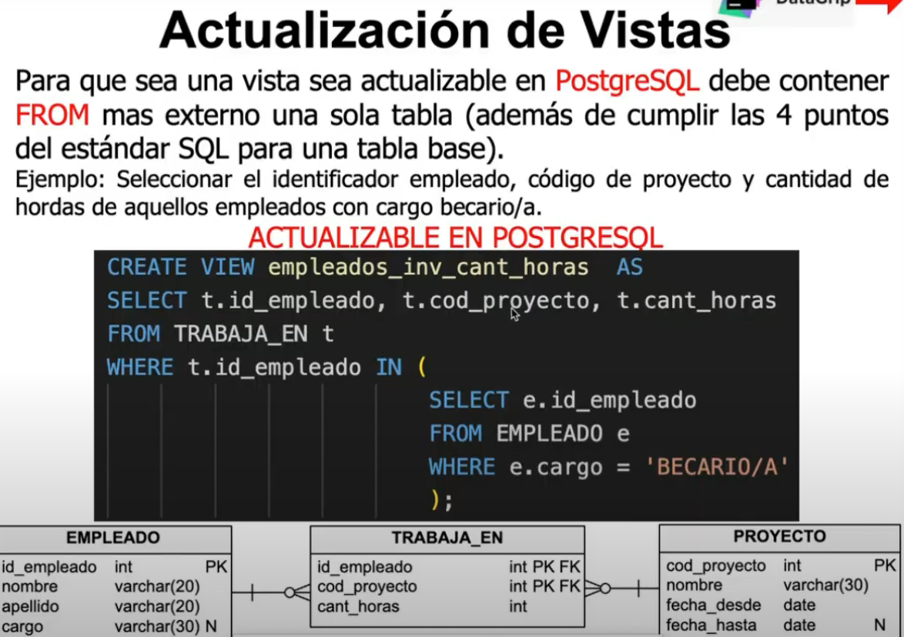
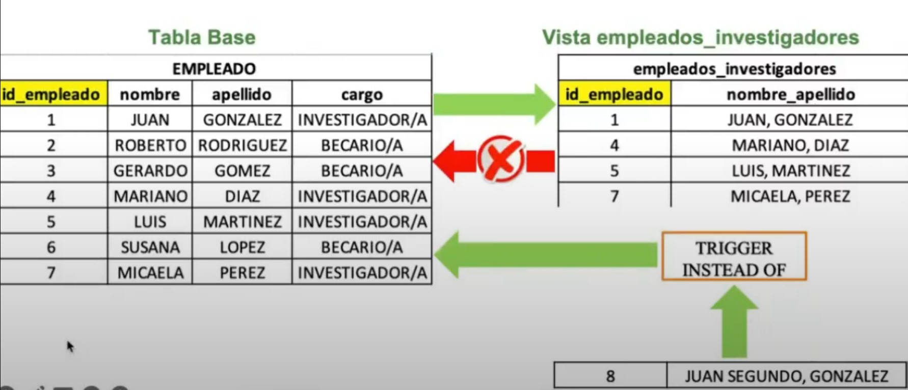
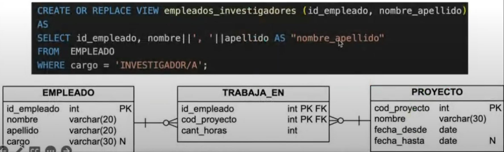

<h1>Vistas</h1>
Representan una tabla virtual y derivada. Su contenido está definido como una consulta sobre una tabla, varias tablas, sobre otra vista, etc.
Cuando se actualizan los registros de una tabla los cambios se reflejan automáticamente sobre la/s vista/s definida/s a partir de ella (por esto mismo de que la vista está definida como una consulta sobre las tablas base o otra vista).

> [!IMPORTANT]
> Que una vista no sea actualizable no quiere decir que esté mal. Dependerá del enunciado si busca que sea actualizable o no.

<h4>Creación</h4>

```SQL
CREATE VIEW <nombre> [col1, col2, ... , coln] AS
<expresión consulta>
[WITH[opción] CHECK OPTION]
```

Ejemplo:

```SQL
CREATE VIEW prov_tandil AS
    SELECT id_proveedor, nombre
    FROM proveedor
    WHERE ciudad = 'Tandil';
```

<h4>Borrado</h4>

```SQL
DROP VIEW <nombre_vista> [ RESTRICT | CASCADED ];
```

- **RESTRICT**: se rechaza si hay objetos del esquema que hacen referencia a esta vista (x defecto).
- **CASCADE**: siempre tiene éxito y se eliminan también las vistas dependientes.

<h3>Vistas actualizables</h3>

**Vistas definidas sobre una tabla**. Características que debe cumplir:

1. El SELECT contiene todas las columnas que conforman la PK.
2. No contiene funciones de agregación o información derivada.
3. No incluye las cláusulas DISTINCT, GROUP BY ni HAVING.
4. No incluye subconsultas en el SELECT.
5. No contiene subconsultas anidadas complejas o múltiples niveles de subconsultas (aunque sean varias pero simples). Tampoco contiene JOINS.

**Vistas definidas sobre más de una tabla**. Características que debe cumplir:

1. Todas las características mencionadas anteriormente (vistas definidas sobre una tabla).
2. El estándar de SQL plantea que una vista definida sobre más de una tabla base (vista de ensamble) es actualizable si preserva la clave de la tabla del lado N.

<p align="center"></p>

> [!CAUTION]
> Sin embargo, esto no es así en PostgreSQL. Para que sea actualizable si o si tiene que haber una sola tabla en el primer FROM (aunque se preserve la clave del lado N de la tabla)

<p align="center"></p>

> [!NOTE]
> Las operaciones de actualización sobre una vista DEBERÍA propagarse automáticamente a operaciones sobre las tablas base (esto no siempre será así, por lo que en algunos casos habrá que usar algunos trucos para forzar que sea actualizable).

<h4>Key-preserved</h4>

<h4>Migración de tuplas de la vista</h4>

<h4>Cláusula WITH CHECK OPTION(WCO)</h4>
This option controls the behavior of automatically updatable views. When this option is specified, INSERT and UPDATE commands on the view will be checked to ensure that new rows satisfy the view-defining condition (that is, the new rows are checked to ensure that they are visible through the view). If they are not, the update will be rejected. If the CHECK OPTION is not specified, INSERT and UPDATE commands on the view are allowed to create rows that are not visible through the view.

```SQL
CREATE VIEW nombre AS
SELECT * FROM tabla
WHERE ciudad = 'Tandil'
WITH [ CASCADED | LOCAL ] CHECK OPTION;
```

- **LOCAL**: New rows are only checked against the conditions defined directly in the view itself. Any conditions defined on underlying base views are not checked (unless they also specify the CHECK OPTION).

- **CASCADED**: New rows are checked against the conditions of the view and all underlying base views.

> [!IMPORTANT]
> If the CHECK OPTION is specified, and neither LOCAL nor CASCADED is specified, then CASCADED is assumed.

[CREATE_VIEW(DocSQL)](https://www.postgresql.org/docs/current/sql-createview.html)

<h4>Triggers instead of</h4>
Intercepta las operaciones de actualización (INSERT-UPDATE-DELETE) sobre una vista y aplica estos cambios en la tabla base, que luego son reflejados en la vista.

<p align="center"></p>

Ejemplo: Crear una vista que retorne el identificador de empleado investigadores junto a su nombre y apellido concatenados por coma.

<p align="center"></p>


<h3>Info faltante</h3>
- [ ] imagenes con ejemplos de código para actualizar vista sobre una o varias tablas
- [ ] key-preserved definicion
- [ ] migración de tuplas de la vista
- [ ] Agregar imagenes en la sección de WCO
- [ ] Triggers instead of
