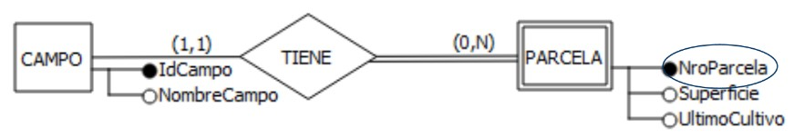
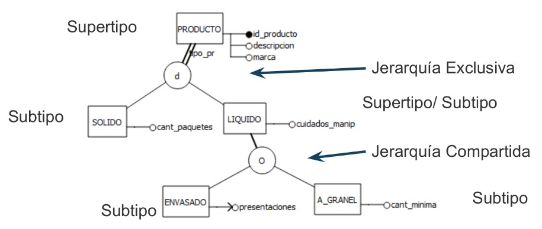
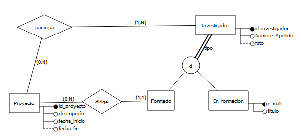
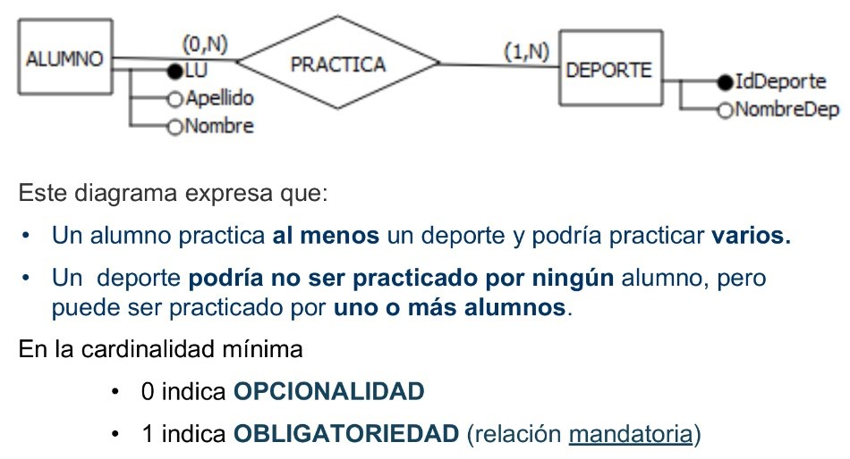
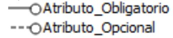
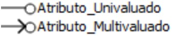
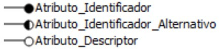
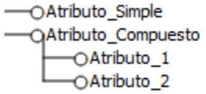
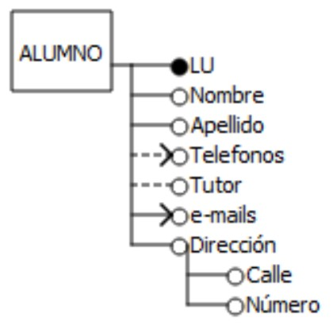

# Entidad
Objeto real o abstracto del que se desea almacenar información. 
* Los objetos inviduales son **instancias** de la entidad.

Tipos de entidades:
* **Fuertes**: Son aquellas que tienen existencia por si solo. Ejemplo: persona.
* **Débiles**: dependen de la existencia de otra entidad. Ejemplo: copia_libro -> original_libro, renglon_remito -> remito.

Entidades fuertes y débiles están vinculadas por una relación binaria (1,1) : (*,N).

### Jerarquías

* **Jerarquía exclusiva**: Cada hijo tiene un solo padre; útil para relaciones uno-a-muchos. Ejemplo: un empleado que puede ser clasificado como "trabajador fijo" o "trabajador temporal".
* **Jerarquía compartida**: Cada padre puede tener múltiples padres; útil para relaciones muchos-a-muchos. Ejemplo: un producto que puede pertenecer a múltiples categorias.

**Ejemplo completo**

> [!IMPORTANT]
> La **línea doble** indica el máximo nivel académico alcanzado por un investigador. Las opciones serían "Formado" o "En_formación", pero no ambos al mismo tiempo.

# Relación 
Asociación o vinculo entre entidades. 

Características de las relaciones:
* **Orden** indica la cantidad de entidades que participan en esta relación:
    * **Unaria(reflexivas/recursivas)**: si hay una entidad involucrada.
    * **Binaria** si hay dos entidades involucradas.
    * **Ternaria** si hay tres entidades involucradas.
    **...**

* **Cardinalidad**: (1:1), (1:N), (N:N).

### Relaciones opcionales vs obligatorias

> [!NOTE]
> La lectura que se hace de las cardinalidades se denomina Look-Across(LA) o Chen-Style, se lee sobre la línea de la "entidad destino".

# Atributos
Características de las entidades y de las relaciones. Proveen detalles descriptivos acerca de ellas.

Características de los atributos:
* **Presencia**
    * **Obligatoria**: siempre habrá un valor para ese atributo.
    * **Opcional**: habrá casos en los que esté ausente.

* **Cardinalidad**
    * **Univaluado**: un solo valor para una misma instancia. Ejemplo: edad.
    * **Multivaluado**: puede haber un conjunto de valores para una misma instancia. Ejemplo: Teléfonos.

* **Rol**
    * **Identificador principal (IP)**
    * **Identificador alternativo**: puede cumplir el rol de IP.
    * **Descriptor**

* **Composicion**
    * **Simple**
    * **Compuesto**

 \

**Ejemplo completo**

# Temas faltantes:

- [ ] Agregaciones 