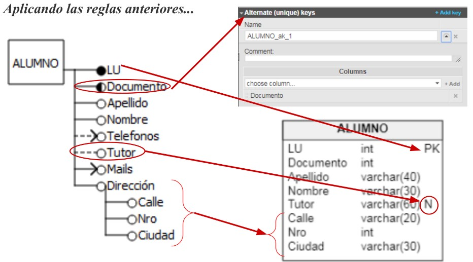
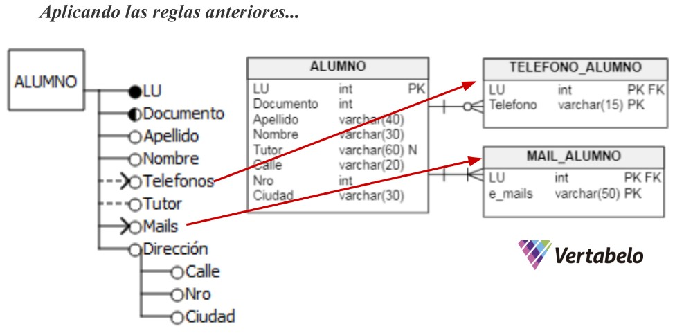
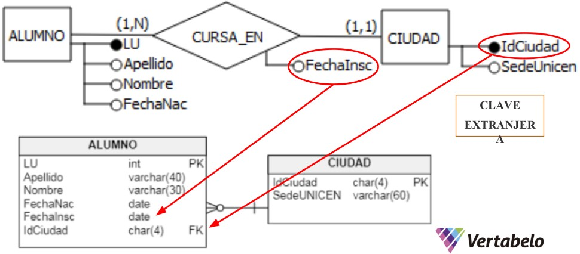
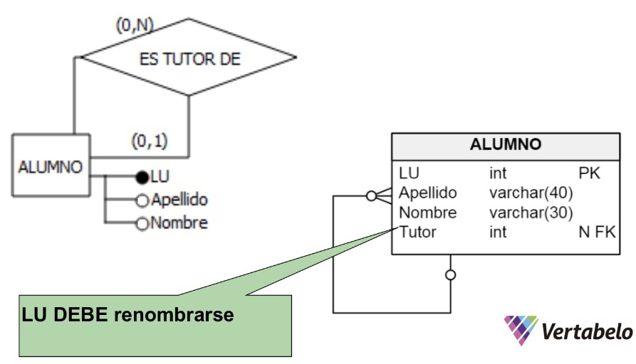
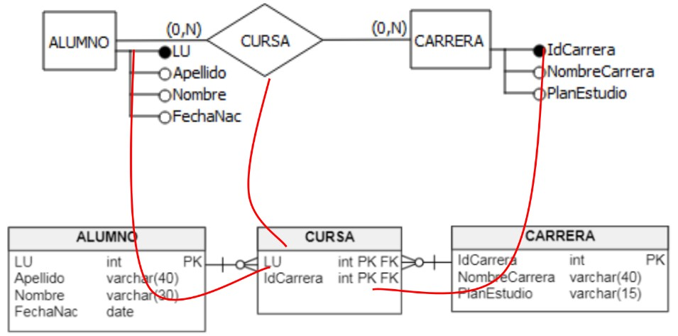
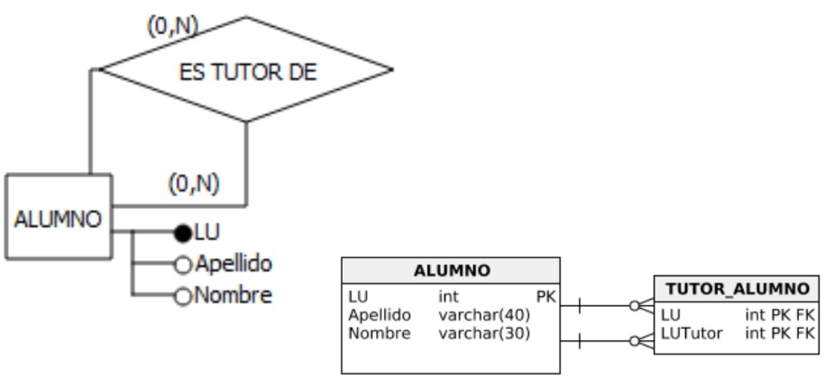
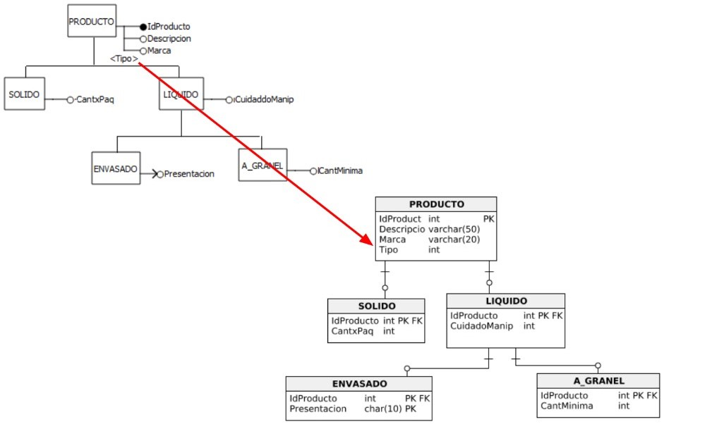
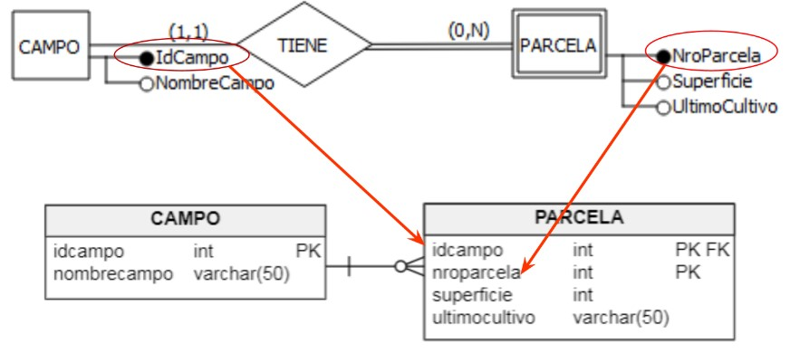
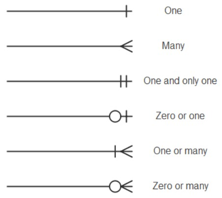

# Introducción

Una base de datos relacional consiste en un **conjunto de tablas**, a cada una de las cuales se le asigna un nombre exclusivo.
* Cada tabla posee un conjunto de columnas cabeceras (atributos) cuyo nombre debe ser único dentro de la tabla.
* Para cada atributo hay un conjunto de valores permitidos, llamado **dominio** de ese atributo.
* Las columnas pueden ser de distintos tipos: numéricos, fechas, booleano, etc. Cualquiera sea el tipo elegido para una columna, debe ser respetado por todos los datos almacenados en la misma.
* En SQL, las filas aparecerán en un orden aleatorio, a menos que se especifique uno.

# Reglas de transformación de Entidades

* Se crea **una tabla por cada entidad**, con el mismo nombre de la entidad.
* El **identificador de la entidad** se transforma en la **clave primaria** de dicha tabla.
* Todo **atributo simplemente valuedo** de la entidad se transforma en un atributo de dicha tabla.
* Los **atributos obligatorios** llevan una leyenda de NOT NULL (en Vertabelo la N significa NULL).
* Los componentes de los **atributos compuestos** se declaran como si fueran univaluados.
* Los **atributos multivaluados**se proyectan en otra tabla junto con la clave de la entidad o de la relación.

# Derivación de relaciones

### Binarias 1:N

Los atributos identificadores de la entidad (clave de la relación) del 'lado 1', también serán declarados como atributos en la tabla del 'lado N' de la relación, constituyendo una clave foránea.

### Unarias 1:N (o N:1)

### Binarias 1:1

### Unarias y Binarias N:N

* Se crea una nueva tabla, cuya PK se conforma de la unión de los identificados (PK) de las entidades participantes.
* El nombre de la tabla será el mismo que el del rombo en el que se basa, o se puede renombrar.
* Las PK de las entidades que participan de la relación, que a su vez conforman la PK de esta nueva tabla, son a su vez, las FK de esta tabla.

# Derivación de jerarquías

* Se crea una tabla por la **entidad supertipo** (con todos sus atributos) y una tabla por cada una de las **entidades subtipo** (con todos sus atributos).
* La **clave de la tabla subtipo** es la clave de la tabla **supertipo**.
* En las jerarquías exclusiva, el **atributo discriminante (tipo)** se debe añadir a la tabla de la entidad supertipo.

# Derivación de entidades débiles

Su PK se conforma de la unión del identificador propio de la entidad débil + el identificador de la entidad fuerte.

# Glosario

**Primary Key (PK)**:

**Foreign Key (FK)**: 

**Cardinalidad de la relaciones (patas de gallo)**:

# Temas faltantes:

- [ ] Derivación de relaciones binarias 1:1.